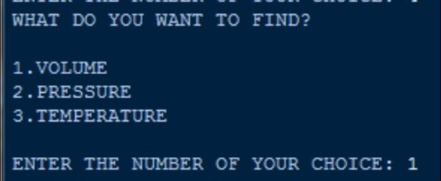

# gas_law_calculator
Capstone Project in OOP, created on 2019

INTRODUCTION

One of the most amazing things about gases is that, despite wide differences in chemical properties, all the gases more or less obey the gas laws.  The gas laws deal with how gases behave with respect to pressure, volume, temperature, and amount.

Boyle's Law: The Pressure-Volume Law

Boyle's law or the pressure-volume law states that the volume of a given amount of gas held at constant temperature varies inversely with the applied pressure when the temperature and mass are constant. V is proportional to the inverse of P. Another way to describing it is saying that their products are constant.

PV = C

When pressure goes up, volume goes down. When volume goes up, pressure goes down. From the equation above, this can be derived:

P1V1 = P2V2

Charles's Law: The Temperature-Volume Law

This law states that the volume of a given amount of gas held at constant pressure is directly proportional to the Kelvin temperature. V is proportional to T. Same as before, a constant can be put in:

V / T = C

As the volume goes up, the temperature also goes up, and vice-versa. Also same as before, initial and final volumes and temperatures under constant pressure can be calculated.

V1 / T1 = V2 / T2

Gay-Lussac's Law: The Pressure Temperature Law

This law states that the pressure of a given amount of gas held at constant volume is directly proportional to the Kelvin temperature. P is proporitonal to T. Same as before, a constant can be put in:

P / T = C

As the pressure goes up, the temperature also goes up, and vice-versa. Also same as before, initial and final volumes and temperatures under constant pressure can be calculated.

P1 / T1 = P2 / T2

The Combined Gas Law

Now we can combine everything we have into one proportion: V is proportional to T divided by P. The volume of a given amount of gas is proportional to the ratio of its Kelvin temperature and its pressure. Same as before, a constant can be put in:

PV / T = C

As the pressure goes up, the temperature also goes up, and vice-versa. Also same as before, initial and final volumes and temperatures under constant pressure can be calculated.

P1V1 / T1 = P2V2 / T2

MANUAL / HOW TO USE

On the Gas Laws program, the program will ask first which gas law would the user want to use: Boyle's Law, Charles' Law, Gay-Lussac's Law, or Combined Gas Law. The program will ask to input the number only. The only numbers valid are 1 to 4. Inputting a string or a number lower than 1 or higher than 4 will result in an error, then it asks the user to input a valid digit. 

After selecting which gas law the user wants to use, depending on which choice, the program will ask what unit would the user wants to find: Volume, Pressure, or Temperature. The unit may vary on which gas law is chosen. It could be Volume and Pressure only for Boyle's Law or Volume and Temperature for Charles's Law. Again, the program will ask the user to input only the number. Attempting to input a string or a larger number will result in an error, then it asks the user to input a valid digit.

After selecting the unit that the user wants to find, the program will ask for variables needed to compute the problem. Take note that the units labeled with 1 (e.g. V1, P1, T1) are always associated with the unit that is missing. If the problem states that V2 is missing, the user should consider it as V1 when using the program. After inputting the variables needed to compute the problem, the program will display the answer rounded to two decimals. The program will know if the equation resulted in division by zero, it will require the user to try again.  If the answer is displayed successfully with no errors, the program will ask if the user wants to try again. Inputting "Y" will loop the program back to start.

